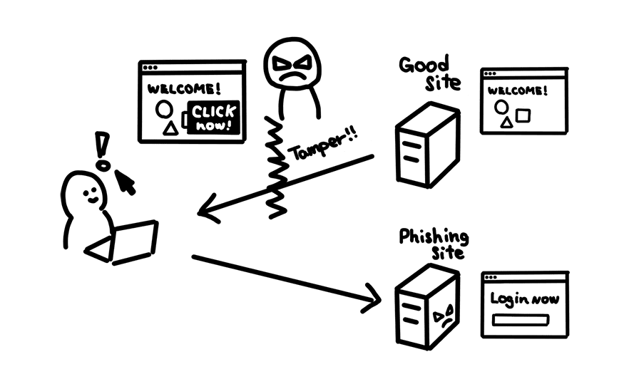
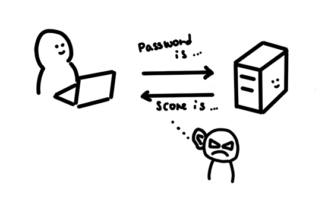

# What are security attacks 

## brief

An insecure application could expose users and systems to various types of damage. When a malicious party uses vulnerabilities or lack of security features to their advantage to cause damage, it is called an attack. We'll take a look at different types of attacks in this guides so you know what to look for when securing your application.

## Active attacks vs passive attacks

<<<<<<< HEAD
Attacks can be devided into two different types: active and passive.
=======
Attacks can be devided into two different types: active and passive. The
>>>>>>> 169cc3d... web 安全 v1.0

### Active attacks

With an **active attack**, the attacker tries to break into the application directly. There are a variety of ways this could be done, form using a false identity to access sensitive data (masquerade attack ) to flooding your server with massive amounts of traffic to make your application unresponsive (denial of service attack)

Active attacks can also be done to data in transit. An attacker could modify your application data before it gets to user's browser, showing modified information on the site or direct the user to an unintended destination. This is sometimes called **modification of messages**

Image below shows a web site being tampered by attackers to guide user to a phishing site.

>Have you ever logged into free public wifi and seen ads wrapped around web pages you are accessing? That's exactly what **modification of message** is! The wifi access point injected their advertising into a website before it got to your browser. In many cases, you might dismiss it as "just ads for free wifi", but imagine if the same technique is used to replace some of the javascript or link to a phishing site. Your site may be used by an attacker to misguide users without you noticing.

### passive attacks

With a passive attack, the attackers tries to collect or learn information from the application but doesn't affect the application itself.

Imagine someone is eavesdropping on your conversion with friends and family, collecting information about your personal life, who your friends are, and where you hang out. The same thing could be done on your web traffic. An attacker could capture data between the browser and the server collecting username and password, users' browsing history ,and data exchanged.

Image below shows attacker eavesdropping communication between a user and a server.

## Defense against attacks

Attacks can directly harm your application or perform a malicious operation on your site without you or your users noticing it. You need mechanism to detect and protect against attacks.

Unfortunately, there is no single solution to make your application 100% secure. In practice, many security features and techniques are used in layers to prevent or further delay the attack(this is called **defense in depth**). If your application contains a form, you might check inputs in the browser, then on the server, and finally at the database; you would also use HTTPS to secure the data in transit.

## wrap up

Since many attacks can happen without ever hitting your server, it is sometimes hard to detect if attacks are happening or not. The good news is that web browser have powerful security features already build in.
