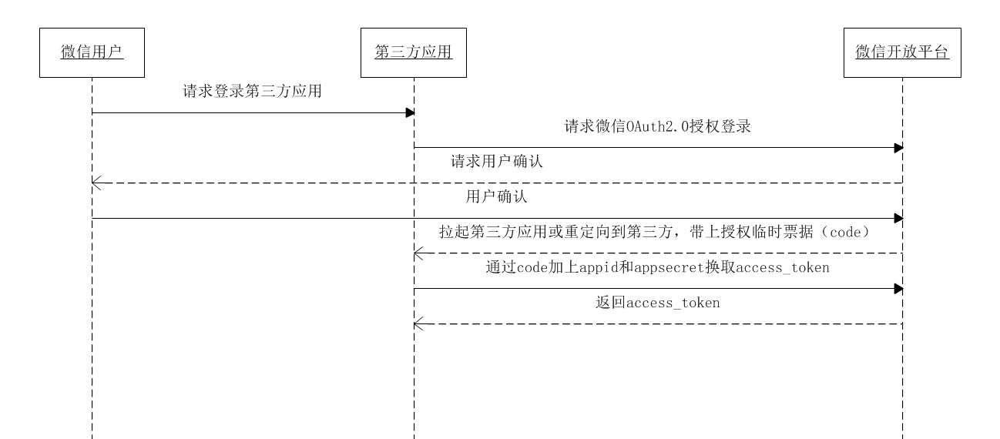

# 前端登录

## 概述

登录是每个网站中经常用到的一个功能,用户在页面上输入账号密码,敲一下回车键,就登陆了,但是这背后的原理是什么呢?下面介绍几种常见的登录方式.

* cookie + session 登录
* token 登录
* sso 单点登录
* OAuth 第三方登录

## cookie + session 登录

`http`是一种无状态协议,客户端每次发送请求时,首先要和服务器建立一个链接,在请求完成后又会断开这个连接.这种方式可以节省传输时占用的连接资源,但同时也存在一个问题:**每次请求都是独立的**,服务器无法判断本次请求和上一次请求是否来自同一个用户,进而无法判断用户的登录状态.

为了解决`HTTP是无状态的`这个问题,*Lou Montulli*在1994年,推出了`Cookie`.
>Cookie是服务器端发送给客户端的一段特殊信息,这些信息以文本的形式存放在客户端,后面客户端每次向服务器发送请求时都会自动带上这些特殊信息

有了`cookie`之后,服务器端就能够客户端传递过来的身份信息了,服务端要对身份信息进行验证,还需要用到`session`
>客户端请求服务端,服务端会为这次请求开辟一块内存空间,这便是`session`对象

有了`cookie`和`session`,就可以进行登录认证了.

### cookie + session 登录认证实现流程

用户首次登录时:


1. 用户访问`a.com/pageA`,并输入密码登录.
2. 服务器验证密码无误后,创建`sessionId`,并将它保存起来
3. 服务器端响应这个`HTTP`请求,并通过`set-cookie`头信息,告知客户端将`SessionId`写入`cookie`中

注意: **服务器端的`sessionId`可能存放在很多地方,例如:内存,文件,数据库等**

第一次登录完成后,后续的访问就可以直接使用`cookie`进行身份验证了:


1. 用户访问`a.com/pageB`页面时,请求头会自动带上第一次登录时写入的`cookie`
2. 服务器端收到后比对`cookie`中的`sessionId`和服务器端存储的`sessionId`是否一致.
3. 如果一致,那么身份验证成功

### cookie + session 模式存在的问题

虽然我们使用`cookie+session`的方式完成了登录验证,但仍然存在一些问题:

* 由于服务器需要对接大量的客户端,也就需要存放大量的`sessionId`,这样会导致服务器压力过大.
* 如果服务器端是一个集群,为了同步登录状态,需要将`sessionId`同步到每一台机器上,无形中增加了服务器端的维护成本
* 由于`sessionId`存放在`cookie`中,浏览器又是自动的带上`cookie`,所以无法避免`CSRF(Cross-site request forgery)`攻击

## token 登录

为了解决`cookie+ session`机制暴露出的诸多问题,我们还可以使用`token`的登录方式.
>Token是服务器生成的一串字符串,作为以后客户端请求的一个令牌.当第一次登录后,服务器会生成一个`token`并返回给客户端,客户端后续访问时,只需要带上`token`即可完成身份认证.

### token机制的流程

用户首次登录时:


1. 用户输入账号密码,点击登录
2. 服务器端验证账号密码无误,通过算法创建`token`
3. 服务器端将`token`返回给客户端,服务器端自己不用保存,**由客户端自由保存**

后续访问页面时:


1. 用户访问`a.com/pageB`时,带上第一次登录时获取的`token`
2. 服务器端验证`token`,有效则身份验证成功.

### token机制的特点

* 服务器端不需要存储`token`,不会对服务器造成压力,即使是服务器集群,也不会增加维护成本
* `token`可以存放在前端任何地方,可以不保存在`cookie`中,这样就不会自动带上token,可以避免跨域攻击,增加安全性.
* `token`下发之后,只要在生效时间之内,就一直有效,服务器端想要收回此`token`的权限,并不容易.

### token的生成方式

最常见的`token`生成方式是使用`JWT(Json Web Token)`,它是一种简洁的,自包含的方法,用于通信双方之间以JSON对象的形式安全的传递信息.

上文中说到,创建token后,服务器端并不会存储`token`,那么服务器端怎么判断客户端传过来的`token`是有效的呢?

答案其实就在`token`字符串中,`token`字符串并不是一串杂乱无章的字符串,而是通过多种算法拼接而成的字符串,下面来具体分析一下.

JWT算法主要分为三个部分: `header(头信息)`,`payload(消息体)`,`signature(签名)`.

`header`部分指定了改JWT使用的签名算法:

```JavaScript
header = '{"alg":"HS256","typ":"JWT"}'   // `HS256` 表示使用了 HMAC-SHA256 来生成签名。
```

`payload`部分表明了`JWT`的意图:

```JavaScript
payload = '{"loggedInAs":"admin","iat":1422779638}'     //iat 表示令牌生成的时间
```

`signature`部分为JWT的签名,主要为了让JWT不能被随意篡改,签名的方法分为两个步骤:

1. 输入`base64url`编码的`header`部分,`.`,`base64url`编码的`payload`部分,输出`unsignedToken`
2. 输入服务器端私钥,`unsignedToken`,输出`signature`签名

```JavaScript
const base64Header = encodeBase64(header)
const base64Payload = encodeBase64(payload)
const unsignedToken = `${base64Header}.${base64Payload}`//注意中间用'.'连接
const key = '服务器私钥'

signature = HMAC(key, unsignedToken) // HMAC: Hash-based Message Authentication Code
```

最后`token`计算如下:

```JavaScript
const base64Header = encodeBase64(header)
const base64Payload = encodeBase64(payload)
const base64Signature = encodeBase64(signature)

token = `${base64Header}.${base64Payload}.${base64Signature}`
```

服务器在判断`token`时:

```JavaScript
const [base64Header, base64Payload, base64Signature] = token.split('.')

const signature1 = decodeBase64(base64Signature)
const unsignedToken = `${base64Header}.${base64Payload}`
const signature2 = HMAC('服务器私钥', unsignedToken)

if(signature1 === signature2) {
  return '签名验证成功，token 没有被篡改'
}

const payload =  decodeBase64(base64Payload)
if(new Date() - payload.iat < 'token 有效期'){
  return 'token 有效'
}
```

有了`token`之后,登录方式已经变得非常高效,接下来介绍另外两种登录方式.

## SSO 单点登录

单点登录(SSO: single sign on),指的是在公司内部搭建一个公共的认证中心,公司下的所有产品的登录都可以在认证中心里完成,一个产品在认证中心登录后,再去访问另外一个产品,可以不用再次登录,即已经处于登录状态.

### SSO 机制实现流程

用户首次访问时,需要在认证中心登录:


1. 用户访问网站`a.com`下的pageA页面
2. 由于没有登录,则会被重定向到认证中心,并带上回调地址(pageA的地址),以便登录后直接进入页面
3. 用户在认证中心输入账号密码,提交登录
4. 认证中心验证通过,创建全局session,创建ticket,然后重定向到pageA,并且带上授权码ticket,并且在首部带上`Set cookie:ssoid=1234`

这时候浏览器根据重定向再次向`a.com`请求pageA,并且带上`ticket`信息


1. 在服务器`a.com`中,拿着`ticket`向认证中心确认,授权码`ticket`真实有效
2. 验证成功后,`a.com`服务器将登陆信息写入首部`set cookie`(此时客户端有2个`cookie`,分别存有`a.com`和`sso.com`的登录状态)
3. 再后来继续请求`a.com`下面的其他页面,因为已经有了该域名存储的`cookie`信息,所以服务器直接认证成功

如果认证中心完成登录之后,访问`b.com`下面的页面:


这个时候,由于认证中心存储有之前登陆过的`cookie`,所以用户不需要再次登录,而是认证中心直接重定向到`b.com`并且带上`ticket`信息.

### SSO 单点登录退出

现在我们考虑单点登录的退出,即在一个产品退出了登录,怎么让其他的产品也都退出登录.

原理也不难,回看上面的步骤,在每一个系统向认证中心进行`ticket`验证的时候,可以顺带将自己的`登出api`也发送给验证中心.

当某个系统`c.com`退出登录时:

1. 清空`c.com`中的登录状态`cookie`
2. 请求认证中心`sso.com`的退出api
3. 认证中心遍历下发过`ticket`的所有产品,并调用对应的退出api,完成其他系统的退出.

## OAuth 第三方登录

>OAuth是Open Authorization的简写.

在上文中,我们使用单点登录完成了很多产品的登录状态共享,但是这都是建立在一套统一的认证中心下,对于一些小型企业,搭建自己的认证中心,未免太麻烦,有没有一种登录方式能够做到开箱即用?

其实是有的,很多大厂都提供了自己的第三方登录服务,下面来分析一下:


### OAuth 机制的实现流程

这里以微信开发平台的接入流程为例:


1. 首先,`a.com`的开发者需要在微信开发平台注册账号,申请使用微信三方登录验证功能.
2. 申请成功后,得到对应的`appid`,`appSecret`.
3. 普通用户在`a.com`上选择使用微信登录
4. 这时会跳转到微信的`OAuth`授权登录页面,并且跳转的时候带上`a.com`的回调地址
5. 用户输入微信账号和密码,登录成功,需要选择具体的授权范围,如:授权用户的头像,昵称等
6. 授权之后,微信会根据之前的重定向信息拉起或直接重定向到`a.com?code=123`,这时带上了一个临时票据code
7. `a.com`会拿着`code`,`appid`,`AppSecret`向微信服务器申请`token`,验证成功后,微信会下发一个token.
8. 有了`token`之后,`a.com`就可以凭借`token`拿到对应的微信用户之前授权的信息(头像,昵称等)
9. `a.com`提示用户登录成功,并将登录状态写入`cookie`,作为以后继续访问的凭证.
10. ?????那怎么退出呢

## 总结

总结一下这4种方案的使用场景:

* `cookie + session`历史悠久,适合简单的后端框架,需要开发人员自己处理好安全问题
* `token`方案对后端来说压力小一些,适合大型分布式的后端框架,但已经分发出去的`token`,如果想收回权限,就不是很方便
* `SSO`单点登录,适合中大型企业,想要统一内部所有产品的登录方式
* `OAuth`第三方登录,简单易用,对于用户和开发者都友好,但第三方平台很多,需要选择适合自己的第三方平台.
