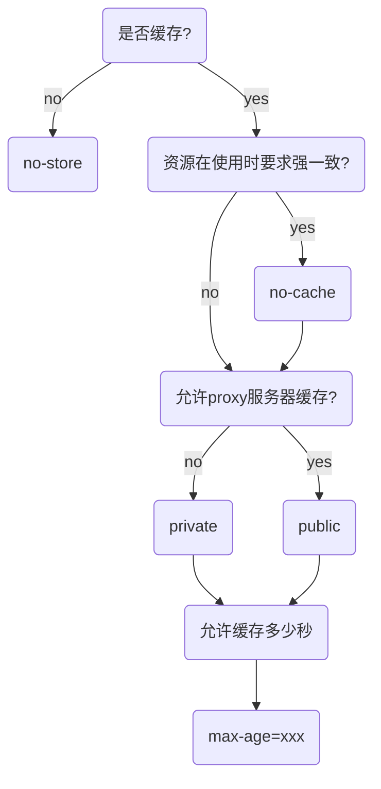
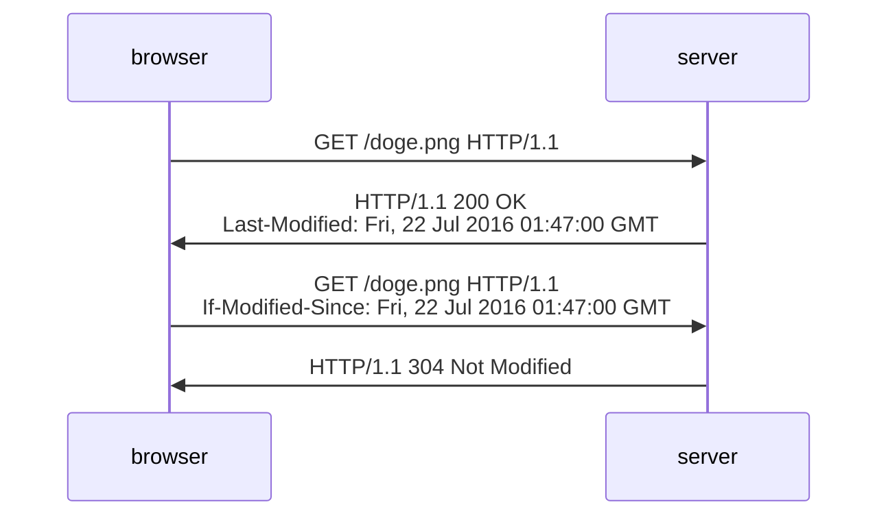
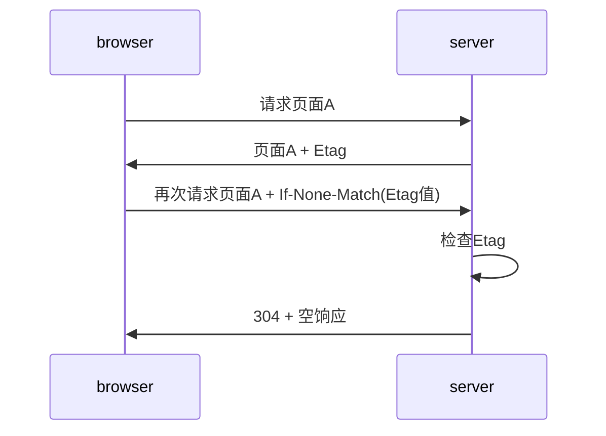
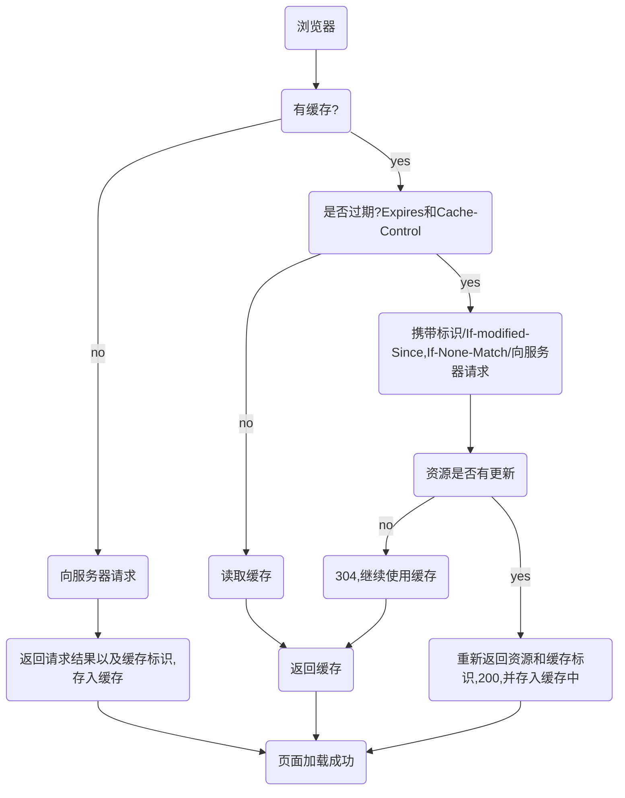

# 浏览器缓存机制

## 概述

缓存是性能优化中简单高效的一种优化方式.一个优秀的缓存策略可以缩短网页请求的资源距离,减少延迟,并且由于缓存文件可以重复利用,还可以减少带宽,降低网络负荷.

对于一个数据请求来说,可以分为`发起网络请求`-->`后端处理`-->`浏览器响应`三个步骤.浏览器缓存可以帮助我们在第一和第三步中优化性能.比如说直接使用缓存不发起请求,或者发起了请求但是后端存储的数据和前端一致,那么就没有必要再将数据返回回来,这样就减少了响应数据.

本文通过`缓存位置`,`缓存策略`,`实际应用场景`这几个方面来讨论浏览器机制


## 缓存位置

从缓存位置上来说分为四种,并且各自有优先级,当依次查找缓存且没有命中的时候,才会去请求网络.

* Service Worker
* Memory Cache
* Disk Cache
* Push Cache

### Service Worker

`Service Worker`是运行在浏览器背后的独立线程,一般可以用来实现缓存功能.使用`Service Worker`的话,**传输协议必须是`HTTPS`**.因为`Service Worker`中涉及到请求拦截,所以必须使用`HTTPS`协议来保障安全.**`Service Worker`的缓存与浏览器其它内建的缓存机制不同,它可以让我们自由控制缓存哪些文件,如何匹配缓存,如何读取缓存,并且缓存是持续性的.**

`Service Worker`实现缓存功能一般分三个步骤:**首先,**需要先注册`Service Worker`,**然后**监听到`install`事件以后就可以缓存需要的文件,**最后**在下次用户访问的时候就可以通过拦截请求的方式查询是否存在缓存,存在缓存的话就可以直接读取文件,否则就去请求数据.

当`Service Worker`没有命中缓存的时候,我们需要调用`fetch`函数获取数据.也就是说,如果我们没有在`Service Worker`命中缓存的话,会根据缓存查找优先级去查找数据.但是不管我们是从`Memory Cache`中还是网络请求中获取的数据,浏览器都会显示我们是从`Service Worker`中获取的内容.

### Memory Cache

`Memory Cache`也就是内存中的缓存,主要包含的是当前页面中已经抓取到的资源,例如页面上已经下载的样式,脚本,图片等.读取内存中的数据肯定比磁盘快,内存缓存虽然读取高效,但是缓存的持续性很短,会随着进程的释放而释放.**一旦我们关闭tab页面,内存中的缓存也就被释放了**, **另外,计算机内存容量有限,我们不能把所有数据都放在内存中缓存**

当我们访问过页面以后,再次刷新页面,可以发现很多数据都来自于内存缓存.


内存缓存中有一块重要的缓存资源是`preloader`相关指令(例如`<link rel="prefetch">`)下载的资源.众所周知`preloader`的相关指令已经是页面优化的常见手段之一,它可以一边解析`js/css`文件,一边网络请求下载一个资源.

需要注意的是,**内存缓存在缓存资源时并不关心返回资源的HTTP缓存头`Cache-Control`是什么值,同事资源的匹配也并非仅仅是对`URL`做匹配,还可能会对`Content-Type`,`CORS`等其他特征做校验.

### Disk Cache

`Disk Cache`也就是存储在硬盘中的缓存,读取速度慢点,但是什么都能存储到磁盘中,**比之`Memory Cache`胜在容量和存储时效性上.**

在所有浏览器中,`Disk Cache`覆盖面基本是最大的.它会根据`HTTP Header`中的字段判断哪些资源需要缓存,哪些资源可以不请求直接使用,哪些资源已经过期需要重新请求.并且即使在跨站点的情况下,相同地址的资源一旦被硬盘缓存下来,就不会再次去请求数据.绝大部分的缓存都来自`Disk Cache`,关于`HTTP`协议头中的缓存字段,会在下文中详细介绍.

#### 浏览器会把哪些文件丢进内存中,哪些丢进硬盘中?

目前网上说法不一,不过以下观点相对靠谱

* 对于大文件来说, 大概率是不存储在内存中,反之优先
* 当前系统内存使用率高的话,文件优先存储进硬盘

### Push Cache

`Push Cache`在国内能够查到的资料很少,因为`HTTP/2`在国内还不够普及.[可以读这篇文章](https://jakearchibald.com/2017/h2-push-tougher-than-i-thought/)总结一下文章中的结论:

* 所有的资源都能被推送,并且能够缓存,但是`Edge`和`Safari`浏览器支持相对较差
* 可以推送`no-cache`和`no-store`的资源
* 一旦连接被关闭,`Push Cache`就被释放
* 多个页面可以使用同一个`HTTP/2`的连接,也就可以使用同一个`Push Cache`.这主要还是依赖浏览器的实现而定.出于对性能的考虑,有的浏览器会对相同域名但不同的`tab`使用同一个`HTTP`连接
* `Push Cache`中的缓存只能被使用一次
* 浏览器可以拒绝接受已经存在的资源推送
* 你可以给其他域名推送资源

如果以上四种缓存都没有命中的话,那么只能发起请求来获取资源了.那么,为了性能上的考虑,大部分的接口都应该选择好缓存策略,**通常浏览器缓存策略分为两种:强制缓存和协商缓存,并且缓存策略都是通过设置`HTTP Header`来实现的**

## 缓存过程分析

浏览器与服务器通信的方式为应答模式,即是:浏览器发起`HTTP`请求 - 服务器响应该请求,**那么,浏览器怎么确定一个资源该不该缓存,如何去缓存呢?**浏览器第一次向服务器发起请求后拿到请求结果,将请求结果和缓存标识放入浏览器缓存,**浏览器对于缓存的处理是根据第一次请求资源时返回的响应头来确定的.**具体过程如下图:

由上图我们可以知道:

* 浏览器每次发起请求,都会先在浏览器缓存中查找该请求的结果以及缓存标识
* 浏览器每次拿到返回的请求结果都会将该结果和缓存标识存入浏览器缓存中

以上两点结论是浏览器缓存机制的关键,它确保了每个请求的缓存存入与读取,只要我们再理解浏览器缓存的使用规则,那么所有的问题就迎刃而解了.为了方便理解,我们根据**是否需要向服务器重新发起`HTTP`请求**将缓存过程分为两种,分别是**强缓存**和**协商缓存**

## 强缓存

>强缓存:不会向服务器发起请求,直接从缓存中读取资源,在`Chrome`控制台和`network`选项中可以看到该请求返回`200`的状态码,并且`size`显示`from disk cache`或者`from memory cache`.强制缓存可以通过设置两种`HTTP Header`实现: `Expires`和`Cache-Control`.

### Expires

**缓存过去时间,用来指定资源到期的时间,是服务器端的具体时间点.** 也就是说,`Expires=max-age + 请求时间`,需要和`Last-modified`结合使用.`Expires`是服务器响应的首部字段,在响应`http`请求时告诉浏览器在过期时间前浏览器可以直接从浏览器缓存中读取数据,无需发起请求.

**`Expires`是`HTTP/1.0`的产物,受限于本地时间,如果修改了本地时间,可能会造成缓存失效.**`Expires: Wed, 3 Mar 2021 11:31:00 GMT`表示资源会在`2021-3-3 11:31:00 GMT`后过期,需要再次请求.

### Cache-Control

在`HTTP/1.1`中,`Cache-Control`是最重要的规则,主要用于控制网页缓存.比如当`Cache-Control:max-age=300`时,则代表这个请求正确返回时间(浏览器会记录下来这个时间)的5分钟内再次加载资源,就会命中强缓存.

`Cache-Control`可以在请求头或者响应头中设置,并且可以组合使用多种指令:
| 指令 | 作用 |
| --- | --- |
| public | 表示响应可以被客户端和代理服务器缓存 |
| private | 表示响应只可以被客户端缓存 |
| max-age=30 | 缓存30秒后过期,需要重新请求 |
| s-maxage=30| 覆盖 max-age, 作用一样,只在代理服务器中生效 |
| no-store | 不缓存任何响应 |
| no-cache | 资源被缓存,但是立即失效,下次会发起请求验证资源是否过期 |
| max-stale=30 | 30秒内,即使缓存过期,也使用该缓存(`这里我有点没搞懂还????`) |
| min-fresh=30 | 希望在30秒内获取最新的响应(`**???**`) |
**public:所有内容都将被缓存(客户端和代理服务器都可缓存)**.具体来说响应可以被任何中间节点缓存,如`browser <-- proxy1 <-- proxy2 <-- server`,中间的`proxy`可以缓存资源,比如下次在请求同一资源`proxy1`会直接把自己缓存的东西给`browser`而不用再向`proxy2`要.

**private:所有内容只有客户端可以缓存,**`Cache-Control`的默认值.具体来说,表示中间节点不允许缓存,对于`browser <-- proxy1 <-- proxy2 <-- server`,`proxy1`会把数据给`browser`并且自己不缓存数据.当下次`browser`再次请求时`proxy`会做好请求转发,而不是自作主张的返回自己缓存的数据.

**no-cache:** 客户端缓存内容,是否使用缓存则需要经过协商缓存来验证决定.使用`Etag`或者`Last-Modified`字段来控制是否使用缓存.**需要注意的是,no-cache这个名字有一点误导.设置了no-cache之后,并不是说浏览器就不在缓存数据,只是浏览器在使用缓存数据时,需要先确认一下数据是否还跟服务器保持一致.

**no-store:** 所有内容都不会被缓存,既不使用强制缓存,也不实用协商缓存

**max-age:**`max-age=xxx(xxx is numeric)`表示缓存内容将在xxx秒后失效

**s-maxage:** 同`max-age`作用一样,只在代理服务器中生效(比如CDN缓存).比如当`s-maxage=60`时,在这60秒中,即使更新了CDN的内容,浏览器也不会进行请求.`max-age`用于普通缓存,而`s-maxage`用于代理缓存.**s-maxage的优先级高于max-age**.如果存在`s-maxage`,则会覆盖掉`max-age`和`expires header`.

**max-stale:** 能容忍的最大过期时间.`max-stale`指令标示了客户端愿意接受一个已经过期的响应.如果指定了`max-stale`的值,则最大容忍时间为对应个秒数.如果没有指定,那么说明浏览器愿意接受任何age的响应(age表示响应由源站生成或确认的时间与当前时间的差值)

**min-fresh:** 能够容忍的最小新鲜度.`min-fresh`标示了客户端不愿意接受新鲜度不多于当前age加上`min-fresh`设定的时间之和的响应.



从图中可以看到,我们可以将多个指令配合起来一起使用,达到多个目的.比如说我们希望资源能被缓存下来,并且是客户端和代理服务器都能缓存,还能设置缓存失效时间等等.

### Expires 和 Cache-Control 两者对比

两者差别其实不大,区别就在于`Expires`是`http/1.0`的产物,`Cache-Control`是`http/1.1`的产物.**两者同时存在的话,Cache-Control优先级高于Expires.** 在某些不支持`http/1.1`的环境下,`Expires`就会发挥用处.**所以Expires其实是过时的东西,现阶段它存在只是一种兼容性的写法.**

## 协商缓存

强缓存判断是否缓存的依据是,是否超出了某个时间段,而不关心服务器端文件是否更新,这可能会导致加载文件不是服务器端最新的内容,那么我们如何知道服务器端的内容是否已经发生了更新呢?此时我们需要用到协商缓存策略.

**协商缓存就是强制缓存失效后,浏览器携带缓存标识向服务器发起请求,由服务器根据缓存标识决定是否使用缓存的过程,主要有以下两种情况:**

* 协商缓存生效,返回`304`和`Not Modified`
* 协商缓存失效,返回`200`和请求结果

协商缓存可以通过设置两种`HTTP Header`实现: `Last-Modified`和`Etag`.

### Last-Modified 和 If-Modified-since

浏览器第一次访问资源时,服务器返回资源的同时,在`response header`中添加`Last-Modified`首部字段,值是这个资源在服务器上的最后修改时间,浏览器接手后缓存文件和字段值.

```yml
Last-Modified: Fri, 22 Jul 2016 01:47:00 GMT
```

浏览器下一次请求这个资源时,浏览器检测到有`Last-Modified`这个字段,于是添加`If-Modified-Since`这个首部字段,值就是`Last-Modified`中的值.服务器再次收到这个资源请求,会根据`If-Modified-Since`中的值与服务器中这个资源的最后修改时间对比,如果没有变化,返回304和空的响应体,告诉浏览器直接从缓存读取,如果`If-Modified-Since`的时间小于服务器中这个资源的最后修改时间,说明文件有更新,于是返回新的资源文件和`200`



但是`Last-Modified`存在一些弊端:

* 服务器如果本地打开缓存文件,即使没有对文件进行修改,但还是会造成`Last-Modified`被修改,服务器不能命中缓存导致发送相同的资源.
* 因为`Last-Modified`只能以秒计时,如果在不可感知的时间内修改完成文件,那么服务器会认为资源还是命中了,不会返回正确的资源.

既然根据文件修改时间来决定是否缓存尚有不足,能否可以直接根据文件内容是否修改来决定缓存策略?所以在`HTTP/1.1`出现了`Etag`和`If-None-Match`

### Etag 和 If-None-Match

**Etag是服务器响应请求时,返回当前资源文件的一个唯一标识(有服务器生成),只要资源有变化,Etag就会重新生成**.浏览器在下一次加载资源向服务器发送请求时,会将上一次返回的Etag值放到请求头的`If-None-Match`里,服务器只需要比较客户端传来的`If-None-Match`的值跟自己服务器上的该资源的`Etag`是否一致,就能很好的判断资源相对客户端而言是否内修改过了.如果服务器发现`Etag`匹配不上,那么直接以常规`GET 200`形式将新的资源(当然也包括了新的Etag)发给客户端,反之,如果`Etag`是一致的,则返回`304`告知客户端直接使用本地缓存即可.



### Etag 和 Last-Modified 对比

* 首先精度上,`Etag`要优于`Last-Modified`
* 性能上`Etag`要逊色于`Last-Modified`,毕竟后者只需要记录时间,而前者需要服务器通过算法来计算出一个`hash`值
* 在优先级上,服务器校验优先考虑`Etag`

## 缓存机制

强制缓存优于协商缓存进行,若强制缓存`(Expires和Cache-Control)`生效则直接使用缓存,若不生效则进行协商缓存`(Last-Modified/If-Modified-Since和Etag/If-None-Match)`,协商缓存有服务器决定是否缓存,若协商缓存失效,那么代表该请求的缓存失效,返回`200`,重新返回资源和缓存标识,在存入浏览器缓存中;生效则返回`304`,继续使用缓存.具体流程如下:



有个疑问:**如果什么缓存策略都没有设置,那么浏览器会怎么处理?** 对于这种情况,浏览器会采用一个启发式的算法,通常会取响应头的`Date`减去`Last-Modified`值的`10%`作为缓存时间.

## 实际场景应用缓存策略

### 频繁变动的资源

```yml
Cache-Control: no-cache
```

对于频繁变动的资源,首先需要使用`Cache-Control:no-cache`使浏览器每次都请求服务器,然后配合`Etag`或者`Last-Modified`来验证资源是否有效.这样的做法虽然不能节省请求数量,但是能显著减少响应数据大小.

### 不常变化的资源

```yml
Cache-Control: max-age=31536000
```

通常在处理这类资源时,给他们的`Cache-Control`配置一个很大的`max-age=3153600(一年)`,这样浏览器之后请求相同的URL会命中强制缓存.而为了解决更新的问题,就需要在文件名(或者路径)中添加hash,版本号等动态字符,之后更改动态字符,从而达到更改引用URL的目的,让之前的强制缓存失效(其实并未立即失效,只是不再使用而已).
在线提供的类库(如`jquery-3.3.1.min.js`,`lodash.min.js`等)均采用这个模式.

## 用户行为对浏览器缓存的影响

所谓用户行为对浏览器缓存的影响,指的就是用户在浏览器操作时,会触发怎么样的缓存策略,主要有3种:

* 打开网页,地址栏输入地址: 查找`Disk cache`中是否有匹配.如果有则使用,没有则发送网络请求
* 普通刷新(F5):因为TAB没有关闭,因此`Memory Cache`是可用的,会被优先使用,其次才是`Disk Cache`
* 强制刷新(ctrl+F5):浏览器不使用缓存,因此发送的请求头部均带有`Cache-Control: no-cache`(为了兼容,还带了`pragma: no-cache`),服务器直接返回200和最新内容

收~