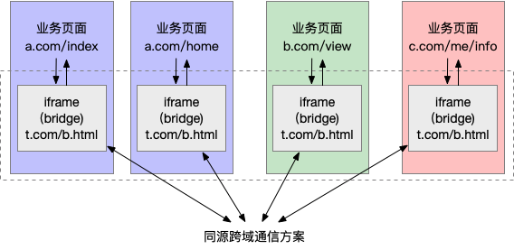

# 浏览器跨tab页通信

## 概述

当前页面需要与当前浏览器已经打开的某个tab页通信,完成某些交互.其中,与当前页面通信的tab页可以与当前页面同源(same origin),也可以是跨域.

### Broadcast Channel

>The **BroadcastChannel** interface represents a named channel that any browsing context of a given origin can subscribe to. It allows communication between different documents (in different Windows ,tabs, frames or iframes) of the same origin. Messages are broadcasted via a message event fired at all `BroadcastChannel` objects listening to the channel.

`BroadcastChannel`可以帮我们创建一个用于广播的通信频道.当所有页面监听同一频道的消息时,这个频道广播的消息就会被所有页面收到.

下面代码创建了一个名为`test`的频道:

```JavaScript
const bc = new BroadcastChannel('test');
```

各个页面可以通过`onmessage`来监听广播的消息:

```JavaScript
bc.onmessage = function (e) {
  const data = e.data;
  const text = '[receive] ' + data.msg + ' —— tab ' + data.from;
  console.log('[BroadcastChannel] receive message:', text);
};
```

通过`postMessage`方法来进行广播:

```JavaScript
bc.postMessage(myData);
```

### Service Worker

>**Service Worker** essentially act as proxy servers that sit between web applications, the browser, and the network(when available), They are intended, among other things, to enable the creation of effective offline experiences, intercept network request and take appropriate action based on whether the network is available, and update assets residing on the server. They will also allow access to push notifications and background sync APIs.

**service worker**是一个长期运行在后台的`web worker`,能够实现与页面的双向通信.多个页面可以共享`service worker`,将`service worker`作为消息的处理中心,即可实现广播的效果.

首先,在页面注册一个`service worker`:

```JavaScript
navigator.serviceWorker.register('../util.sw.js').then(function () {
  console.log('Service Worker 注册成功');
});
```

其中`../util.sw.js`是对应的`service worker`脚本.`service worker`本身不具备**广播**功能,需要我们添加代码,将其改造成消息中转站:

```JavaScript
/* ../util.sw.js Service Worker 逻辑 */
self.addEventListener('message', function (e) {
    console.log('service worker receive message', e.data);
    e.waitUntil(
        self.clients.matchAll().then(function (clients) {
            if (!clients || clients.length === 0) {
                return;
            }
            clients.forEach(function (client) {
                client.postMessage(e.data);//这里实现广播
            });
        })
    );
});
```

我们在service worker中监听了message事件,获取页面(从service worker的角度叫`client`)发送的消息.然后通过`self.clients.matchAll()`获取当前注册了改service worker的所有页面,通过调用每个client(即页面)的`postMessage`方法,向页面发送消息.这样就把从一处(某个tab页)收到的消息通知给了其它页面.

注册了service worker,我们需要在页面监听service worker发来的消息:

```JavaScript
/* 页面逻辑 */
navigator.serviceWorker.addEventListener('message', function (e) {
    const data = e.data;
    const text = '[receive] ' + data.msg + ' —— tab ' + data.from;
    console.log('[Service Worker] receive message:', text);
});
```

最后,需要广播消息的时候,调用service worker的postMessage方法:

```JavaScript
/* 页面逻辑 */
navigator.serviceWorker.controller.postMessage(myData);
```

我反正还没有怎么弄明白,后面再看

### LocalStorage

`LocalStorage`作为前端常用的本地存储,大家应该不陌生.但是`storageEvent`这个与它相关的事件有些人可能比较陌生.

当`LocalStorage`变化时,会触发`storage`事件.利用这个特性,我们可以在发送消息时,把消息写入到某个`LocalStorage`中,然后在各个页面里面通过监听`storage`事件即可收到通知.

```JavaScript
window.addEventListener('storage', function (e) {
    if (e.key === 'ctc-msg') {
        const data = JSON.parse(e.newValue);
        const text = '[receive] ' + data.msg + ' —— tab ' + data.from;
        console.log('[Storage I] receive message:', text);
    }
});
```

在各个页面添加上面的代码,即可监听到`LocalStorage`的变化.当某个页面需要发送消息时,只需要使用`setItem`方法即可:

```JavaScript
myData.st = +(new Date);
window.localStorage.setItem('ctc-msg', JSON.stringify(myData));
```

**注意** 这里有一个细节,我们在`myData`上添加了一个时间戳,因为`storage`事件只有在值真正改变的时候才会触发. 举个例子:

```JavaScript
window.localStorage.setItem('test', '123');
window.localStorage.setItem('test', '123');
```

上面的代码只会触发一次`storage`事件,因为两次的值是一样的.

### share worker

有点复杂,晚点再研究

### IndexDB

这个也有点复杂,晚点再研究

### window.open + window.opener

当我们使用`window.open`打开页面时,方法会返回一个被打开的页面的引用.在被打开的页面,可以通过`window.opener`来获取打开它的页面的引用--这样两个页面直接就建立了联系.像一个树的结构.

首先,我们把`window.open`打开的页面的页面引用收集起来:

```JavaScript
let childWins = [];
document.getElementById('btn').addEventListener('click', function () {
    const win = window.open('./some/sample');
    childWins.push(win);
});
```

然后,当我们需要发送消息的时候,作为消息的发起方,一个页面需要同时通知它打开的页面与打开它的页面:

```JavaScript
// 过滤掉已经关闭的窗口
childWins = childWins.filter(w => !w.closed);
if (childWins.length > 0) {
    myData.fromOpener = false;
    childWins.forEach(w => w.postMessage(myData));
}
if (window.opener && !window.opener.closed) {
    myData.fromOpener = true;
    window.opener.postMessage(myData);
}
```

下面看看,作为消息接收方,需要做什么.此时接收到消息的页面,还需要将消息传递给它所有联系的页面:

```JavaScript
window.addEventListener('message', function (e) {
    const data = e.data;
    const text = '[receive] ' + data.msg + ' —— tab ' + data.from;
    console.log('[Cross-document Messaging] receive message:', text);
    // 避免消息回传
    if (window.opener && !window.opener.closed && data.fromOpener) {
        window.opener.postMessage(data);
    }
    // 过滤掉已经关闭的窗口
    childWins = childWins.filter(w => !w.closed);
    // 避免消息回传
    if (childWins && !data.fromOpener) {
        childWins.forEach(w => w.postMessage(data));
    }
});
```

这样,每个页面都肩负起了传递消息的责任,消息就在这个树状结构中流转起来.

### websocket

当然还可以通过服务器`websocket`来实现通信, 相当于吧服务器当成消息中心,这里也先不研究,后面专门写一篇关于`websocket`的技术文档

### 非同源页面之间的通信

上面介绍的跨页面通信,基本都受到同源策略的限制.然而有些时候,我们有两个不同域名的产品线,也希望它们下面的页面能够无障碍通信.该怎么办?

要实现该功能,可以使用一个用户看不见的`iframe`作为桥,由于`iframe`与父页面之间可以用过指定的`origin`来忽略同源限制,因此可以在每个页面中嵌入一个`iframe`(例如:`http://sample.com/bridge.html`),这些`iframe`由于使用的是同一个url,因此属于同源页面,其通信方式可以使用上面提到的`BroadcastChannel`.

首先在页面监听消息:

```JavaScript
/* 业务页面代码 */
window.addEventListener('message', function (e) {
    // …… do something
});
```

然后，当页面要与其他的同源或非同源页面通信时，会先给 iframe 发送消息：

```JavaScript
/* 业务页面代码 */
window.frames[0].window.postMessage(mydata, '*');
```

在`iframe`中使用`BroadcastChannel`监听信息:

```JavaScript
/* iframe 内代码 */
const bc = new BroadcastChannel('AlienZHOU');
// 收到来自页面的消息后，在 iframe 间进行广播
window.addEventListener('message', function (e) {
    bc.postMessage(e.data);
});
```

其它页面收到广播后,将信息传递给自己的父页面:

```JavaScript
/* iframe 内代码 */
// 对于收到的（iframe）广播消息，通知给所属的业务页面
bc.onmessage = function (e) {
    window.parent.postMessage(e.data, '*');
};
```

下图就是使用`iframe`作为*桥*的非同源页面间通信模式图:


## 总结

对于同原页面,常见的方式包括:

* 广播模式: BroadcastChannel, service worker, LocalStorage + storageEvent
* 共享存储模式: shared worker, indexedDB, cookie
* 口口相传模式: window.open + window.opener
* 基于服务器: websocket, comet, sse等

对于费同原页面:

* 利用 iframe 做桥

完~
